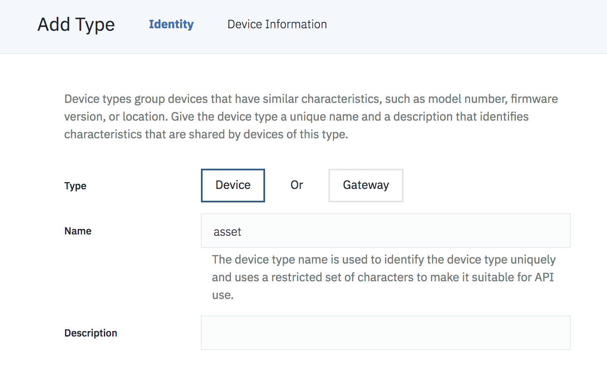
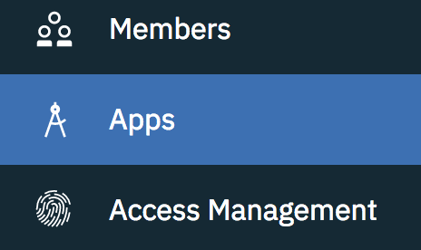

# Asset Tracking with Blockchain and IoT Workshop

In this workshop, we will be creating a local Hyperledger Fabric network

# Creating the Logspout Container

# Packaging chaincode

# Installing and Instantiating

# Adding Identities to the Wallet

# Invoking transactions with the IBM Blockchain Platform VSCode Extension

# Invoking transactions with the Node SDK
In this section we will be invoking the transactions defined in assetContract using the the **fabric-network** module. This is a new module introduced in Hyperledger Fabric 1.4.

In each of the orgs' **application** folder you will find **invoke.js**. In this file we will be copying and pasting the code to invoke transactions and see what the response is.

1. In your code editor, navigate to this repo and open **org1/application/invoke.js**
2. Look for the **Transaction Invocation block comment section.


3. In between the end of that comment block and the **End of transaction invocation section**, paste in the code for each transaction mentioned below:

## Manufacture Asset
The manufactureAsset transaction creates a new digital asset to be stored on the ledger. Once the transaction is successful, the new asset is returned.


```javascript

    const manufactureResponse = await contract.submitTransaction('manufactureAsset', 'manufacturer1','A-006', 'asset');
    let asset = Asset.fromBuffer(manufactureResponse);

    console.log(asset);

    console.log(asset.manufacturer + " has manufactured an asset with asset number "+asset.assetNumber);
    
```

## Transfer Asset
The transferAsset transaction transfers ownership of the asset within the ledger. Returns the transferred asset

```javascript

    const manufactureResponse = await contract.submitTransaction('manufactureAsset', 'manufacturer1','A-006', 'asset');
    let asset = Asset.fromBuffer(manufactureResponse);

    console.log(asset);

    console.log(asset.manufacturer + " has manufactured an asset with asset number "+asset.assetNumber);
    
```

## Create Lease
The createLease transaction creates a lease which defines the lessee, lessor, and other lease terms. Returns the created lease.

```javascript

    const manufactureResponse = await contract.submitTransaction('manufactureAsset', 'manufacturer1','A-006', 'asset');
    let asset = Asset.fromBuffer(manufactureResponse);

    console.log(asset);

    console.log(asset.manufacturer + " has manufactured an asset with asset number "+asset.assetNumber);
    
```

## Return Asset
The returnAsset transaction is invoked when a lessee wants to return the leased asset at the end of the lease. Returns the returned asset and the lease that has ended.

```javascript

    const manufactureResponse = await contract.submitTransaction('manufactureAsset', 'manufacturer1','A-006', 'asset');
    let asset = Asset.fromBuffer(manufactureResponse);

    console.log(asset);

    console.log(asset.manufacturer + " has manufactured an asset with asset number "+asset.assetNumber);
    
```

## Inspect Asset
The inspectAsset transaction is invoked when the asset has been received and inspected by the vendor. This transaction records the percent of damage to the asset on the lease. Returns the inspected asset and lease.

```javascript

    const manufactureResponse = await contract.submitTransaction('manufactureAsset', 'manufacturer1','A-006', 'asset');
    let asset = Asset.fromBuffer(manufactureResponse);

    console.log(asset);

    console.log(asset.manufacturer + " has manufactured an asset with asset number "+asset.assetNumber);
    
```

## Repair Asset
The repairAsset transaction is called after the asset has been repaired. Sets the asset condition to **Refurbished** and the state to **Available**. Returns the repaired asset.

```javascript

    const manufactureResponse = await contract.submitTransaction('manufactureAsset', 'manufacturer1','A-006', 'asset');
    let asset = Asset.fromBuffer(manufactureResponse);

    console.log(asset);

    console.log(asset.manufacturer + " has manufactured an asset with asset number "+asset.assetNumber);
    
```

## Return Deposit
The returnDepost transaction records the amount of the depost to be returned to the lessee. This is calculated by looking at the percent of the asset damaged which was recorded in the lease by the inspectAsset transaction and then multiplying the original deposit paid by a percent which corolates with the amount of damage. (e.g. >20% damage to the asset = 80% of the original deposit returned). Returns the lease.

```javascript

    const manufactureResponse = await contract.submitTransaction('manufactureAsset', 'manufacturer1','A-006', 'asset');
    let asset = Asset.fromBuffer(manufactureResponse);

    console.log(asset);

    console.log(asset.manufacturer + " has manufactured an asset with asset number "+asset.assetNumber);
    
```

## Destroy Asset
The destroyAsset transaction removes the asset from ledger at the end of the asset's lifecycle. Returns the destroyed asset.

```javascript

    const manufactureResponse = await contract.submitTransaction('manufactureAsset', 'manufacturer1','A-006', 'asset');
    let asset = Asset.fromBuffer(manufactureResponse);

    console.log(asset);

    console.log(asset.manufacturer + " has manufactured an asset with asset number "+asset.assetNumber);
    
```

# Creating the Node-Red simulated device application
Now we need to create the simulated IoT device which will invoke the updateAssetLocation with the location where the device was "scanned". We will be using the IBM IoT Platform to facilitate the communicaton from our virtual device to a local IoT service which will be listening for published device events. 

For the code used to build this virtual device, we will be using a framework called Node-Red which is a low code environment which allows for drag and drop of preconfigured nodes to easily build applications. 

IBM Cloud has a starterkit for IoT applications that comes with a Node-Red application and an instance of the IoT Platform service already bound to it. 

1. Go to your IBM Cloud dashboard
2. Click on **Catalog** at the top right of the page
3. From the catalog, select **Starter Kits** from the category list on the left side to narrow the services shown.
4. Then, find and click on the **Internet of Things Platform Starter** kit.


5. On the next page, give the new application a name. It's important that the name be unique so that there are no hostname conflicts with other applications out there. To make it easy, you can add your initials before the hostname (e.g. My name is Oliver Rodriguez so I might name my application or-asset-tracking).

6. Click create. This creation process will take a bit.

7. Once the application is deployed, click on **View app** to go to the application.

8. The first time you open a Node-Red application you have to go through the initial set up wizard. To start, create an admin username and password. You can also select the checkbox to give read access to anybody that visit's your app.

9. When done with the wizard you should be taken to the application. The page that you are brought to is called the **Canvas** which is where you drag and drop your nodes. The left pane that holds all the nodes is called the **pallette**. You may notice that this application already comes with some starter code, go ahead and select it all with your curser by clicking and draging and then press your delete key.

10. We will be importing some of our own code for the virtual device. To do this, click on the menu button at the top right, select **import** and **clipboard**. Then paste in the contents of the **flow.json** file from this repo.

11. Then, click anywhere in the pallette to finalize the import. You should now have a simple flow with a few nodes.

Now that we have our flow imported, we now need to use the IBM IoT Platform to facilitate communication between the virtual device and the local IoT application.

# Connect with the IBM IoT Platform

1. From the dashboard, click on the Watson IoT Platform service
2. On the overview page for the service, click on **Launch**

;

3. Once in the IoT Platform, click on the **Devices** button from the left navigation panel.

;

## Create a new Device Type

4. Once in the devices page, click on **Add Device** at the top right of the page.
5. Click on the **Device Type** tab at the top left of the page.
6. Once on the new page, click on **Add Device Type** at the top right.
7. Then, ensure **Type** is **Device** and enter **asset** as the **Name**

;

8. Click **Next** and click **Done** on the next page.


## Register a new device

9. On the new page, click on **Register Devices**

;

10. Next, ensure that **asset** is selected as the **Device Type** and enter **A-001** as the **DeviceID**
11. Click **Next**, and then **Next** again on the device defaults page, and then **Next** again on the token generation page.
12. Click **Done** to complete device registration
13. Once you complete registration, you will be taken to the **Device credentials** page. Copy everything in the **Device credentials** object and save it in a seperate doc.

 It's important to copy the Authentication Token as you will not be able to retrieve it once you leave the page. 

;


## Register an App
Now we need to register an application with the platform to generate an API key

1. Click on the **Apps** button on the left navigation panel

;

2. On the Apps, page, click on **Generate API Key** at the top right of the page.

3. Add a description if you wish, then click on **Next**

4. On the new page, select **Standard Application** as the **Role**

1[role](./images/role.png);

5. Click **Generate Key**

6. Once the API Key has been added, copy both the **API Key** and the **Authentication Token** to a seperate doc.

Again, just like with the device credentials, you cannot retrieve the token once you leave the page. Be sure to have it copied somewhere.

Now that we have our device registered and the credentials saved, let's return to our code editor.

# Configuring the local IoT Service 

# Scan Device