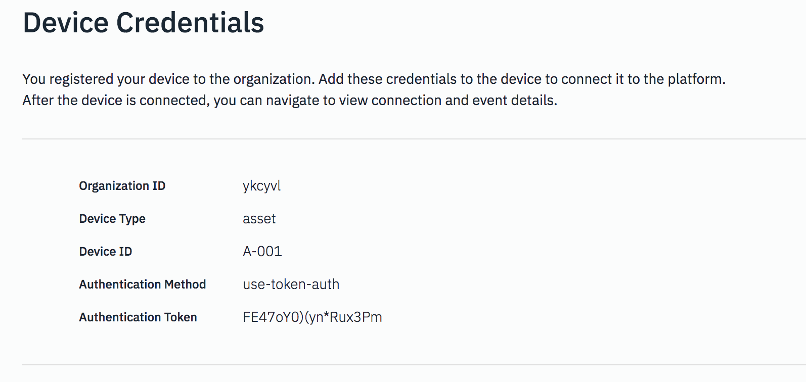

# Creating the Logspout Container

# Packaging chaincode

# Installing and Instantiating

# Adding Identities to the Wallet

# Invoking transactions with the IBM Blockchain Platform VSCode Extension

# Invoking transactions with the Node SDK

# Creating the Node-Red simulated device application

# Connect with the Watson IoT Platform

1. From the dashboard, click on the Watson IoT Platform service
2. On the overview page for the service, click on **Launch**

;

3. Once in the IoT Platform, click on the **Devices** button from the left navigation panel.

;

## Create a new Device Type

4. Once in the devices page, click on **Add Device** at the top right of the page.
5. Click on the **Device Type** tab at the top left of the page.
6. Once on the new page, click on **Add Device Type** at the top right.
7. Then, ensure **Type** is **Device** and enter **asset** as the **Name**

;

8. Click **Next** and click **Done** on the next page.

## Register a new device

9. On the new page, click on **Register Devices**

;

10. Next, ensure that **asset** is selected as the **Device Type** and enter **A-001** as the **DeviceID**
11. Click **Next**, and then **Next** again on the device defaults page, and then **Next** again on the token generation page.
12. Click **Done** to complete device registration
13. Once you complete registration, you will be taken to the **Device credentials** page. Copy everything in the **Device credentials** object and save it in a seperate doc.

 It's important to copy the Authentication Token as you will not be able to retrieve it once you leave the page. 

;

## Register an App
Now we need to register an application with the platform to generate an API key

1. Click on the **Apps** button on the left navigation panel

;

2. On the Apps, page, click on **Generate API Key** at the top right of the page.

3. Add a description if you wish, then click on **Next**

4. On the new page, select **Standard Application** as the **Role**

1[role](./images/role.png);

5. Click **Generate Key**

6. Once the API Key has been added, copy both the **API Key** and the **Authentication Token** to a seperate doc.

Again, just like with the device credentials, you cannot retrieve the token once you leave the page. Be sure to have it copied somewhere.

Now that we have our device registered and the credentials saved, let's return to our code editor.

# Configuring the local IoT Service 

# Scan Device